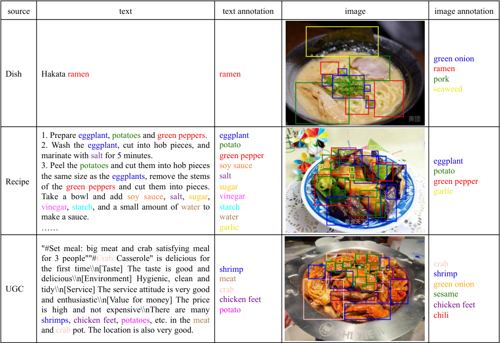
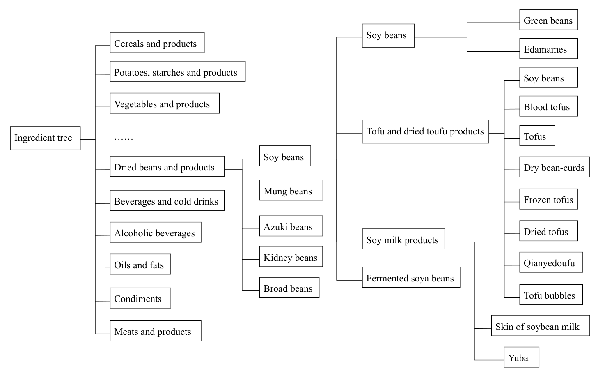
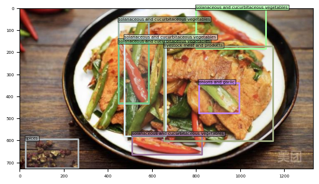
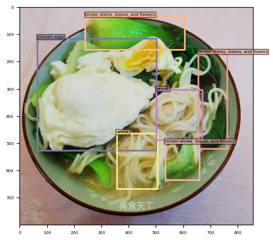
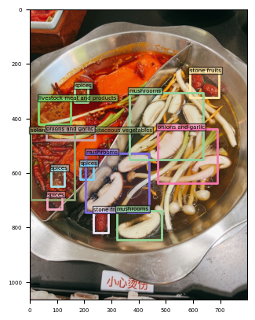
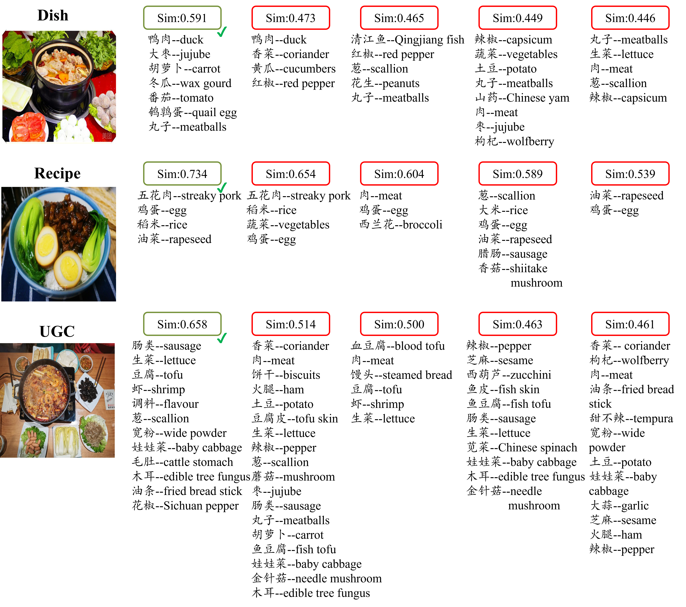

<!DOCTYPE html>
<html>
<table align="center" border="0" cellpadding="0" cellspacing="0">
    <tbody>
    <tr valign="middle">
        <td width="100%">
            

                <h1 style="font-size:2em;padding-top:1em;">Toward Chinese Food Understanding: a Cross-Modal Ingredient-Level Benchmark</h1>
                <h4>
                    Lanjun Wang1&nbsp;&nbsp;&nbsp;&nbsp;
                    Chenyu Zhang1&nbsp;&nbsp;&nbsp;&nbsp;
                    An-An Liu1&nbsp;&nbsp;&nbsp;&nbsp;
                    Bo Yang1&nbsp;&nbsp;&nbsp;&nbsp;
                    Mingwang Hu1&nbsp;&nbsp;&nbsp;&nbsp;
                    Xinran Qiao1&nbsp;&nbsp;&nbsp;&nbsp;
                    Lei Wang2&nbsp;&nbsp;&nbsp;&nbsp;
                    Jianlin He2&nbsp;&nbsp;&nbsp;&nbsp;
                    Qiang Liu2&nbsp;&nbsp;&nbsp;&nbsp;
                </h4>
                
1Tianjin University&nbsp;2Meituan Group

    </tbody>
</table>

 

    

        <h2>Content</h2>
        

            <big>
            <ul>
            <li><a href="#intro">Introduction</a></li>
            <li><a href="#dataset">CMIngre Dataset</a></li>
            <li><a href="#task">Task</a></li>
            <li><a href="#citation">Citation</a></li>
            </ul>
            </big>
        

    

    

        <h2>Introduction</h2>
        

            <big>
            This is the supplementary material for the paper "Toward Chinese Food Understanding: a Cross-Modal Ingredient-Level Benchmark" <a href="https://ieeexplore.ieee.org/document/10496846">[link]</a>.
            The web intends to release the dataset CMIngre in our paper and introduce related tasks and usage methods.
            </big> 
        

    

    

        <h2>CMIngre Dataset</h2>
        

            <big>
            <ol>
            <li>Overview</li>
                As shown in <a href="#annotation">Figure 1</a>, CMIngre consists of 8,001 image-text paris from three sources, where 1,719 from dishes, 2,330 from recipes, and 3,952 from user-generated content (UGC).
                <ul>
                    <li>Dish Images. As depicted in the second row, this category includes images of dishes paired with their names.</li>
                    <li>Recipe Images. Shown in the third row, these data consist of recipe images accompanied by detailed recipe text.</li>
                    <li>User-Generated Content (UGC). This type, illustrated in the last row, involves images taken by users and their accompanying comments.</li>
                </ul>
            

                 
                
                

                Figure 1. Food images in CMIngre comes from three sources, where UGC refers to the user-generated content such as the user comment.
                

            

             
            <li>Comparison with Existing Food Datasets
                
We compare CMIngre with other food related datasets in <a href="#table1">Table 1</a>. It can be observed that existing food-related datasets mainly focus on the food recognition task, which aims to recognize the food category within the image. Although few datasets do provide annotations for food bounding boxes, their objective is to locate the entire dish, not the free-form ingredients. In contrast, Recipe 1M offers ingredient annotations for each food image. However, due to the absence of location annotations for these fine-grained ingredients, they only implicitly model the associations between entire food images and corresponding ingredients, limiting the model performance. Consequently, we introduce CMIngre, aimed at enhancing the understanding of Chinese food by ingredient detection and retrieval tasks.

            <table id="table1" style="text-align: center;">
                 
                
Table 1. The statistical comparison between existing food-related datasets and CMIngre.

                 
                <tr style="border-top: 1px solid;border-bottom: 1px solid;">
                    <th style="text-align: center;">Dataset</th>
                    <th style="text-align: center;">Task</th>
                    <th style="text-align: center;">Image Number</th>
                    <th style="text-align: center;">Annotation Category</th>
                    <th style="text-align: center;">Number of Annotation Category</th>
                    <th style="text-align: center;">BBox</th>
                </tr>
                <tr>
                    <td>ChileanFood64</td>
                    <td>Food Recognition</td>
                    <td>11,504</td>
                    <td>Food</td>
                    <td>64</td>
                    <td>&#10003;</td>
                </tr>
                <tr>
                    <td>UECFood256</td>
                    <td>Food Recognition</td>
                    <td>29,774</td>
                    <td>Food</td>
                    <td>256</td>
                    <td>&#10003;</td>
                </tr>
                <tr>
                    <td>UNIMIB2016</td>
                    <td>Food Recognition</td>
                    <td>1,027</td>
                    <td>Food</td>
                    <td>73</td>
                    <td>&#10003;</td>
                </tr>
                <tr>
                    <td>ISIA Food-500</td>
                    <td>Food Recognition</td>
                    <td>1,027</td>
                    <td>Food</td>
                    <td>73</td>
                    <td>&#10005;</td>
                </tr>
                <tr>
                    <td>Food2K</td>
                    <td>Food Recognition</td>
                    <td>1,036,564</td>
                    <td>Food</td>
                    <td>2,000</td>
                    <td>&#10005;</td>
                </tr>
                <tr>
                    <td>Recipe 1M</td>
                    <td>Recipe Retrieval</td>
                    <td>1,029,720</td>
                    <td>Recipe</td>
                    <td>1,047</td>
                    <td>&#10005;</td>
                </tr>
                <tr style="border-bottom: 1px solid;">
                    <td>CMIngre</td>
                    <td>Ingredient Detection &amp; Retrieval</td>
                    <td>8,001</td>
                    <td>Ingredient</td>
                    <td>429</td>
                    <td>&#10003;</td>
                </tr>
            </table>
            </li>
            <li>Visualization Tools
                <ul>
                    <li> Classification Tool: As shown in <a href="#ontology">Figure 2</a>, we categorize all ingredients into the appropriate leaf node of <a href="https://www.chinanutri.cn/fgbz/fgbzhybz/201707/t20170721_148433.html">a hierarchical ontology</a> through a classification tool, which is provided in the "knowledge" folder.</li>
                    <li> Fusing Tool: We review and merge ingredients with identical semantics under the same parent node through a fusing tool, which is provided in the "fusing" folder. </li>
                    

                         
                        
                        

                        Figure 2. The ontology used to clean labels in CMIngre. In this figure, we show the complete sub-tree under the super-class “Dried beans and products”. The leaf nodes are ingredient labels after cleaning up and the non-leaf nodes are from the standard.
                        

                    

                </ul>
            </li>
            </li>
            <li>Download
                

                    <b>TODO</b>
                    <ul>
                        <li>确认数据集上传到huggingface</li>
                        <li>确认要上传的数据集，从2003服务器上找到的一个VOC格式429个类8001张注释后图片的文件夹。这个数据集是用于目标检测的，食材检测和食材检索是否有两个不同的数据集，或者两个任务的数据集是一样的，只不过根据任务转换成了不同的格式。</li>
                        <li>转换数据集的格式为CSV格式或者Parquet格式</li>
                    </ul>
                

            </li>
            </ol>
            </big>
        

    

    

        <h2>Task</h2>
        

            <big>
            Our dataset involves two tasks, i.e. ingredient detection and cross-modal ingredient retrieval.
            <ul>
                <li>Ingredient detection focuses on identifying the ingredients and providing precise location information within the image. As shown in <a href="#detection">Figure 3</a>, we locate and identify the ingredients in food images from dish, recipe, and UGC.
                

                     
                    

                        <!-- 
                        
                         -->
                        
                    

                    

                        Figure 3. The ingredient detection visualization of theree food images from dish, recipe, and UGC.
                    

                

                </li>
                <li>Cross-modal ingredient retrieval aims to investigate the intricate relationship between the image and the composition of ingredients. We visualize top-5 retrieval results by randomly sampling a query object from dish, recipe, and UGC in the test set. As shown in <a href="#img2ingre">Figure 4</a>, the corresponding ingredient composition appears in the first index position of the retrieval list with the highest matching similarity. Similarly, as shown in <a href="#ingre2img">Figure 5</a>, the corresponding image appears in the first index position of the retrieval list with the highest matching similarity.
                

                     
                    
                    

                    Figure 4. The top-5 retrieval visualization of three random query images from dish, recipe, and UGC.
                    

                

                

                     
                    
                    

                    Figure 5. The top-5 retrieval visualization of three query ingredient composition from different sources.
                    

                

                </li>
            </ul>
            </big>
        

    

    

        <h2>Citation</h2>
        <b>BibTeX<b>: 
        <code> 
            @inproceedings{li2023photomaker, 
            &nbsp;&nbsp;title={Toward Chinese Food Understanding: a Cross-Modal Ingredient-Level Benchmark}, 
            &nbsp;&nbsp;author={Wang, Lanjun and Zhang, Chenyu and Liu, An-An and Yang, Bo and Hu, Mingwang and Qiao, Xinran and Wang, Lei and He, Jianlin and Liu, Qiang}, 
            &nbsp;&nbsp;booktitle={IEEE Transactions on Multimedia}, 
            &nbsp;&nbsp;year={2024}, 
            &nbsp;&nbsp;publisher={IEEE} 
            } 
        </code> 
    

</html>